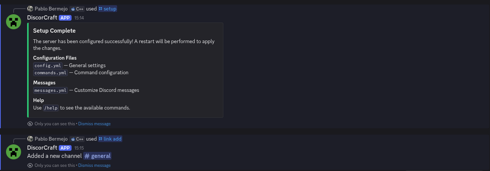
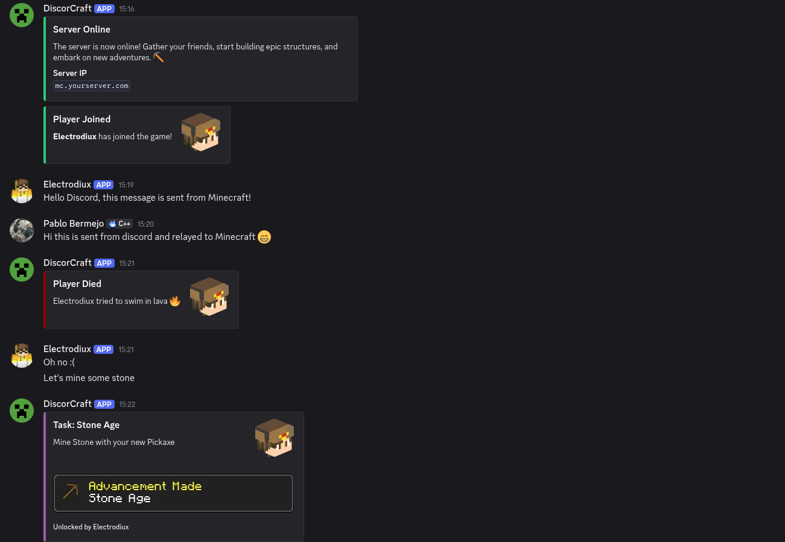
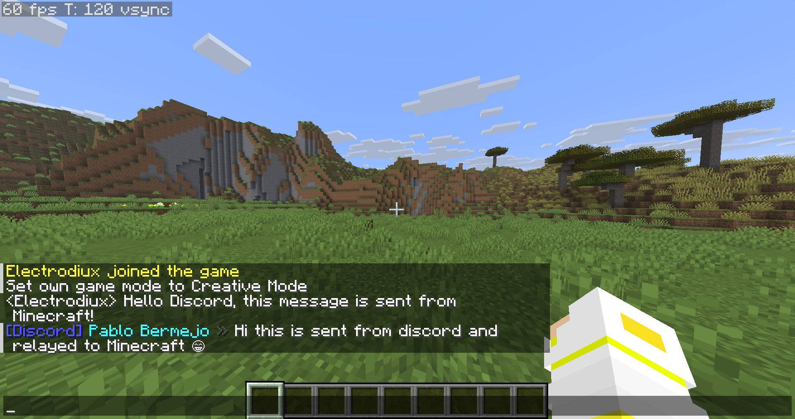

# DiscordCraft

[](LICENSE)
[](https://github.com/pablobh2147/discordcraft/releases)
[](https://github.com/pablobh2147/discordcraft/actions/workflows/build-release.yml)
[](https://github.com/pablobh2147/discordcraft/actions/workflows/publish-platforms.yml)

A Discord integration plugin and mod for Minecraft servers. Bridge your Minecraft server chat with Discord channels, manage your server from Discord with slash commands, and keep your community connected.

Currently supports Spigot and Spigot forks (Paper, Purpur, etc.) and NeoForge.

## Features

- **Bidirectional chat** — Minecraft chat messages appear in Discord and vice versa
- **Player events** — Join, leave, death, and kill notifications forwarded to Discord
- **Server status** — Automatic start/stop announcements in Discord
- **Discord slash commands** — Manage your server directly from Discord (`/ban`, `/pardon`, `/whitelist`, `/stop`, `/playerlist`, etc.)
- **Channel linking** — Link multiple Discord channels with individual message-type filters
- **Customizable messages** — Every message the bot sends is fully configurable via `messages.yml`
- **Customizable commands** — Enable/disable and configure each Discord command in `commands.yml`
- **Bot activity** — Show a custom status on the bot (Playing, Watching, etc.)

## Examples

### Discord setup



### Discord chat



### Minecraft chat



## Installation

For complete installation instructions, see the **[Installation Guide](INSTALL.md)**.

## Documentation

- **[Installation Guide](INSTALL.md)** — Step-by-step setup instructions
- **[Configuration Guide](docs/CONFIGURATION.md)** — Detailed configuration, commands, and customization
- **[Troubleshooting Guide](docs/TROUBLESHOOTING.md)** — Common issues and solutions
- **[FAQ](docs/FAQ.md)** — Frequently asked questions

## Building for Development

Useful Gradle commands:

```bash
./gradlew build                # build everything
./gradlew :common:build        # build only the common library
./gradlew :<platform>:build   # build only the platform-specific plugin/mod
./gradlew :<platform>:dev     # build + deploy to <platform>/server/plugins/
./gradlew dev                  # root convenience task delegating to the active platform
```

Replace `<platform>` with `spigot`, `neoforge`, `fabric`, etc. To build and deploy to the local test server in one step, run `./gradlew dev`.

## License

This project is licensed under the MIT License — see the [LICENSE](LICENSE) file for details.
